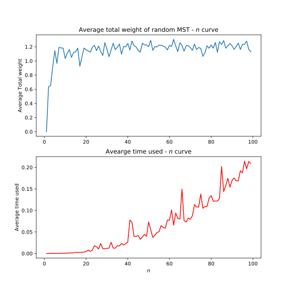

# Random minimum spanning tree problem

Author: Li Yiming

- Complete graph
- Uniform [0, 1) weight
- Prim's algorithm



See my [report](report.md) (in Chinese) for more technical information.

Run test cases and see the logs under `log` folder (you have to manually create it if not exist):

```bash
python test/test.py
```

The log file with `INFO` is a simple version of log, and `DEBUG` is a more verbose version of log.

For example, the `correctness-DEBUG.log` file has the detail of Prim algorithm:

```txt

vertex 0 popped up, weight = 0
	vertex 0 with weight 0.35596957149150465
	vertex 0 ignored (has been poped up)
	vertex 1 with weight 0.8018955321605898
	vertex 1 discovered
	vertex 2 with weight 0.6997460634318478
	vertex 2 discovered

vertex 2 popped up, weight = 0.6997460634318478
	vertex 0 with weight 0.6997460634318478
	vertex 0 ignored (has been poped up)
	vertex 1 with weight 0.3705274891431274
	vertex 1 discovered
	vertex 2 with weight 0.7245549487821699
	vertex 2 ignored (has been poped up)

vertex 1 popped up, weight = 0.3705274891431274
	vertex 0 with weight 0.8018955321605898
	vertex 0 ignored (has been poped up)
	vertex 1 with weight 0.0008942167048560101
	vertex 1 ignored (has been poped up)
	vertex 2 with weight 0.3705274891431274
	vertex 2 ignored (has been poped up)

Total weight of the MST is 1.0702735525749751
```

## Reference

1. https://www.math.cmu.edu/~af1p/Texfiles/MST.pdf
2. https://en.wikipedia.org/wiki/Random_minimum_spanning_tree