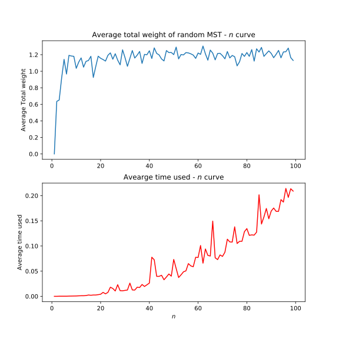

# 随机算法实验 4 - 最小生成树期望权值计算

<center>

主讲教师: 骆吉洲

姓名: 李一鸣    学号: 1160300625    日期: 2019 年 5 月 21 日

</center>

## 一、实验要求（实验题目概述）

实验目的为：

1. 理解蒙特卡罗算法的过程和效用
2. 体会由经验公式得到理论公式的过程
3. 规范撰写实验报告

实验内容为：

实现一种随机图，在随机图上实现对最小生成树的抽样过程，由抽样过程实现蒙特卡罗方法计算最小生成树权值的数学期望估计，比较估计结果的准确性。

实验步骤：

1. 实现算法产生 n 顶点随机图的生成

    ```txt
    输入：n
    输出：一个 n 顶点随机图，任意两个顶点之间边的权值均匀分布于 (0,1)
    ```

2. 调用第 1 步实现的算法，实现对 n 顶点图的均匀抽样
3. 在抽样样本上计算最小生成树并计算其权值的数学期望
4. 在第 2 步第 3 步的基础上，建立 n 与最小生成树权值数学期望间的关系
5. 对 $n=16,32,64,128,256,512,1024 \cdots$展开实验，考察算法运行时间的变化，并检验所建立的关系的一般性
6. 尝试用理论分析解释实验结果
7. 撰写实验报告

## 二、实验原理（对实验步骤的详细阐述）

### $n$ 顶点随机图

随机图分为两种模型 $G_{n,p}$ 和 $G_{n,N}$。

在 $G_{n,p}$ 模型中，生成随机图的方法是按照某个次序考虑 $C_n^2$ 条边中所有可能的边，以概率 $p$ 独立地往图上添加每条边，所以图中边的期望数为 $pC_n^2$，且每个顶点的期望度数为 $(n-1)p$。

在 $G_{n,N}$ 模型中，生成随机图方法是从没有边的图开始，均匀随机地选取 $C_n^2$ 条可能边中的一条，将其加入图中，接下来独立且均匀随机地选取剩余 $C_n^{2}-1$ 条可能边中的一条，并将它添加到图中，一直这样下去，直到选完 $N$ 条边为止。

$G_{n,p}$ 和 $G_{n,N}$ 模型是有关系的，当 $p = N/C_{n}^2$ 时，$C_{n,p}$ 中的一个随机图的边数在 $N$ 附近，且在来自 $G_{n,p}$ 中的一个图有 $N$ 条边的条件下，此图均匀来自 $G_{n,N}$ 中的所有图。这个关系类似于将 $m$ 个球投入 $n$ 个箱子中，从而每个箱子内球的个数是均值 $m/n$ 的泊松分布之间的关系。

在随机图与球和箱子模型之间存在许多类似之处。在 $G_{n,N}$ 模型中，将边（每条边占两个点，相当于两个球，共 $2N$）放到图（$n$）中就好像将球放入箱子里。因此，我们可以利用赠券收集的结论：

> 赠券收集：投入 $m = n\ln+cn$ 个球之后，仍有空箱子的概率不超过 $e^{-c}$。

得到下面的定理：

定理 1：设 $N = \frac{1}{2}(n\ln n+cn)$，在 $C_{n,N}$ 中存在孤立点的概率随 $n$ 增长无穷趋近于 $e^{-c}$。

## 三、实验过程（实验数据、对实验结果的理解和分析）

### 随机图生成方法 `_get_graph`

使用 $G_{n,p}$ 模型生成随机图。令 $p$ 为 $1$，这样我们得到的随即图就是完全图。

生成结果以邻接表 `adj_list` 的形式返回给调用者。

### 最小生成树计算方法 `run`

首先调用 `_get_graph` 随机生成一个邻接表，根据这个邻接表构造实际的 `Vertex` 数据结构，再使用《算法导论》中给出的 Prim 算法进行最小生成树的计算，算法如下：


### 测试

在 `test.py` 中进行正确性测试和性能测试。数据都是用 `_get_graph` 随机生成的，我们无需担心。

#### 正确性测试

结果如下：

```txt
Adjacent list is below:
0 (2, 0.8283091938724143)
0 (4, 0.9763232120615708)
1 (3, 0.8418846877393964)
1 (4, 0.26668105259129526)
2 (0, 0.8283091938724143)
2 (4, 0.3376198672978312)
3 (1, 0.8418846877393964)
3 (4, 0.973781096617964)
4 (0, 0.9763232120615708)
4 (1, 0.26668105259129526)
4 (2, 0.3376198672978312)
4 (3, 0.973781096617964)

vertex 0 popped up, weight = 0
	vertex 2 with weight 0.8283091938724143
	vertex 2 discovered
	vertex 4 with weight 0.9763232120615708
	vertex 4 discovered

vertex 2 popped up, weight = 0.8283091938724143
	vertex 0 with weight 0.8283091938724143
	vertex 0 ignored (has been poped up)
	vertex 4 with weight 0.3376198672978312
	vertex 4 discovered

vertex 4 popped up, weight = 0.3376198672978312
	vertex 0 with weight 0.9763232120615708
	vertex 0 ignored (has been poped up)
	vertex 1 with weight 0.26668105259129526
	vertex 1 discovered
	vertex 2 with weight 0.3376198672978312
	vertex 2 ignored (has been poped up)
	vertex 3 with weight 0.973781096617964
	vertex 3 discovered

vertex 1 popped up, weight = 0.26668105259129526
	vertex 3 with weight 0.8418846877393964
	vertex 3 discovered
	vertex 4 with weight 0.26668105259129526
	vertex 4 ignored (has been poped up)

vertex 3 popped up, weight = 0.8418846877393964
	vertex 1 with weight 0.8418846877393964
	vertex 1 ignored (has been poped up)
	vertex 4 with weight 0.973781096617964
	vertex 4 ignored (has been poped up)

Total weight of the MST is 2.2744948015009374
```

#### 性能和结果测试

按照实验要求，分别计算了实验的不同 $n$ 值下计算出的最小生成树平均权值（对每个 $n$ 调用 `run` 方法 10 次并对返回值取平均），得到平均权值、平均运行时间随 $n$ 的增加变化曲线如下：



可以看到随着 $n$ 的增大，随机图的最小生成树的平均权值收敛于 1.2。[维基百科上](https://zh.wikipedia.org/wiki/%E9%9A%8F%E6%9C%BA%E6%9C%80%E5%B0%8F%E7%94%9F%E6%88%90%E6%A0%91)有相关记载。

看上去这个结论是不合常理的，随着 $n$ 的增加，最小生成树的边的数量越来越多，因此权值总和也应该不断增加才对。但是实验结果确是如此，让人不得不惊叹，维基百科给出了原始的论文链接，数学过程比较复杂，我觉得并不是我们要关心的，而这个可以推广到不是均匀分布的一般分布上，非常有用。

## 实验感想（实验过程中最值得说起的几个方面）

1. `python` 的 `queue` 有一个坑，我的 `Vertex` 重载了 `__lt__` 小于符号，结果出现有的时候第二次 pop 出来的却是 `key` 值为 `infty` 的那个元素。最终我使用了 `heap` 来实现，每次 pop 之前都需要调用一次 `heapify`。
2. 性能优化也值得一提，刚开始的时候，运行 1-100 所有可能的 $n$ 一遍需要大概 77 秒，非常慢。经过性能调优发现主要的时间花在了 Prim 算法上面，然后矩阵的生成使用双重循环比较耗时，因此直接调用 `numpy` 生成邻接矩阵，在 Prim 算法中因为已经知道了是完全图，所以直接对全体顶点进行处理即可。直到算法完全精简为止，还是不太能在数秒的级别运行到 $n=1024$，但是 $n=512$ 完全没有任何问题了。

## 参考文献

1. On the value of a random minimum spanning tree problem